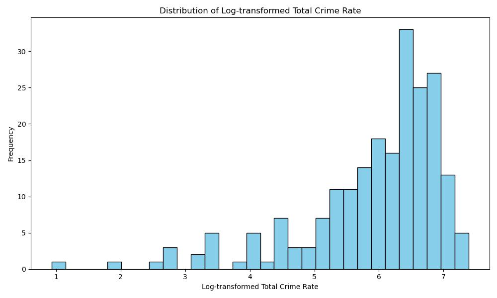

# Identifying Key Drivers of Youth Crime

## Problem Statement
In 2024, Kids First, a US NGO, was awarded a grant from the US Department of Justice (US DOJ) to investigate recent trends (years 2016 to 2022) in crime in young adults (ages 16 to 24) across the United States. We here at SAL Analytics were contracted by Kids First to perform an analysis using socioeconomic, educational attainment, and state demographic data to determine which factors had an impact on youth crime. By examining the strength of these relationships, this analysis will identify the key drivers of youth crime. The findings will provide Kids First with data-driven insights to determine the best allocation of grant resources to positively impact youth crime rates, such as for economic support, youth programs, and/or substance abuse treatment. Using the understandings gleaned from this analysis, Kids First will be able to provide evidence-based recommendations to the US DOJ, and to policymakers, educational institutions, and public safety organizations alike, in order to reduce crime in young adults.

## Research Question
This analysis aims to answer the following question:  
> "What socioeconomic, educational, and demographic factors are most strongly associated with variations in youth crime rates among young adults (ages 16 to 24) across U.S. states?"

## Table of Contents
1. [Identifying Key Drivers of Youth Crime](#identifying-key-drivers-of-youth-crime)
2. [Problem Statement](#problem-statement)
3. [Research Question](#research-question)
4. [Analysis](#analysis)
    - [Notebook 1: Data Cleaning and Preparation](code/01_EDA_and_Data_Cleaning.ipynb)
    - [Notebook 2: Model Benchmarks](code/02_Model_Benchmarks.ipynb)
    - [Notebook 3: Model Tuning](code/03_Model_Tuning.ipynb)
    - [Notebook 4: Production Model and Insights](code/04_Production_Model_and_Insights.ipynb)
5. [Executive Summary](#executive-summary)
    - [Introduction](#introduction)
    - [Data Collection](#data-collection)
    - [Data Dictionary](#data-dictionary)
    - [Exploratory Data Analysis (EDA)](#exploratory-data-analysis-eda)
    - [Model Performance and Evaluation](#model-performance-and-evaluation)
    - [Conclusion](#conclusion)
    - [Key Takeaways](#key-takeaways)
    - [Next Steps](#next-steps)
6. [Setup Instructions and Software Requirements](#setup-instructions-and-software-requirements)
## Executive Summary
### Introduction
Youth crime poses significant challenges to communities, affecting social cohesion, economic stability, and public safety. Understanding the underlying causes is essential for developing effective prevention and intervention strategies. Research indicates that factors such as poverty, unemployment, lack of education, and certain demographic characteristics can contribute to higher crime rates among young adults. By analyzing data over a decade, this project seeks to uncover patterns and correlations that can inform targeted approaches to mitigate youth crime.

### Data Collection
This project uses the following key datasets:

* **[`CPS March 2024 Documentation`](https://www2.census.gov/programs-surveys/cps/techdocs/cpsmar24.pdf)**: Provides labor force statistics, including median income, poverty rate, unemployment rate, high school graduation rate, and bachelor’s degree graduation rate.
* **[`FRED Economic Data Series`](https://fred.stlouisfed.org/)**: A comprehensive range of economic indicators, including employment and unemployment data, state-specific economic insights, and housing and construction metrics.
* **[`CDC WONDER MCD Expanded Data`](https://wonder.cdc.gov/wonder/help/mcd-expanded.html)**: Mortality and morbidity statistics, including crude rates for suicide and overdose per 100,000 population.
* **[`Kids Count Data Center`](https://datacenter.kidscount.org/)**: Youth-related metrics essential for understanding factors impacting young populations within communities.
* **[`Bureau of Justice Statistics (BJS)`](https://www.bjs.gov/)**: Supplies crime data critical for examining patterns in criminal activity and understanding community safety.

During data preparation, key cleaning steps included removing null values, handling missing data through imputation, and transforming certain variables (e.g., log-transforming crime rates) to reduce skewness. 
### Data Dictionary

| Feature                              | Type     | Dataset                        | Description                                                                                           |
|--------------------------------------|----------|--------------------------------|-------------------------------------------------------------------------------------------------------|
| **state**                            | *object* | Census/FRED Dataset            | The U.S. state where the data was collected.                                                          |
| **year**                             | *integer*| Census/FRED Dataset            | The year in which the data was recorded.                                                              |
| **median_income**                    | *integer*| CPS March 2024                 | Median income in the state in USD.                                                                    |
| **poverty_rate**                     | *float*  | CPS March 2024                 | Percentage of the population living below the poverty line.                                           |
| **unemployment_rate**                | *float*  | FRED/CPS Dataset               | Overall unemployment rate in the state.                                                               |
| **unemployed_15_weeks**              | *float*  | FRED Dataset                   | Percentage of the labor force unemployed for 15 weeks or more.                                        |
| **labor_force_participation_rate**   | *float*  | FRED Dataset                   | Labor force participation rate among the working-age population.                                      |
| **hs_grad_rate**                     | *float*  | CPS March 2024                 | High school graduation rate in the state.                                                             |
| **bachelors_grad_rate**              | *float*  | CPS March 2024                 | Bachelor's degree graduation rate in the state.                                                       |
| **zhvi**                             | *float*  | FRED Dataset                   | Zillow Home Value Index, representing the median home value.                                          |
| **crude_rate_suicide**               | *float*  | CDC WONDER MCD                 | Crude suicide rate per 100,000 population.                                                            |
| **crude_rate_od**                    | *float*  | CDC WONDER MCD                 | Crude overdose rate per 100,000 population.                                                           |
| **rate:__crimes_against_society**    | *float*  | BJS Dataset                    | Rate of crimes against society per 100,000 population.                                                |
| **rate:__fraud_and_other_financial_crimes** | *float* | BJS Dataset           | Rate of fraud and other financial crimes per 100,000 population.                                      |
| **rate:__property_crime**            | *float*  | BJS Dataset                    | Rate of property crimes per 100,000 population.                                                       |
| **rate:__violent_crime**             | *float*  | BJS Dataset                    | Rate of violent crimes per 100,000 population.                                                        |
| **youth_not_in_school**              | *float*  | Kids Count Data Center         | Number of youths (ages 16-19) not enrolled in school.                                                 |
| **youth_in_foster_care**             | *float*  | Kids Count Data Center         | Number of youths in foster care.                                                                      |
| **youth_living_in_poverty**          | *float*  | Kids Count Data Center         | Number of youths living below the poverty line.                                                       |
| **total_crime_count**                | *float*  | BJS Dataset                    | Aggregate count of all crime categories.                                                              |
| **total_crime_rate**                 | *float*  | BJS Dataset                    | Aggregate crime rate per 100,000 population.                                                          |

### Exploratory Data Analysis (EDA)

 Below are some of the visualizations generated during the EDA process.

#### Distribution of Total Crime Rate
The log-transformation was applied to the total crime rate to normalize its distribution. This transformation helps in visualizing and analyzing crime rates with less skewness.

#### Trends of Different Types of Crime Over the Years
This visualization shows the trends of various types of crime over the years, allowing us to observe patterns or changes in crime rates across different categories over time.

### Model Performance and Evaluation

We tested several regression models to analyze and predict target variables based on key features in our dataset. The goal was to compare the performance of each model using key metrics, including R² Score, Mean Squared Error (MSE), and Mean Absolute Error (MAE).

#### Models Evaluated:
1. **Linear Regression**
2. **Ridge Regression**
3. **Decision Tree**
4. **Random Forest**
5. **Gradient Descent**
6. **XGBoost**
7. **Support Vector Machine (SVM)**
8. **Stacking Model**
9. **Bagging XGBoost Model**

#### Summary of Model Performance

| **Model**                      | **R² Score (Train)** | **R² Score (Test)** | **Mean Squared Error (Train)** | **Mean Squared Error (Test)** | **Mean Absolute Error (Train)** | **Mean Absolute Error (Test)** |
|--------------------------------|----------------------|---------------------|--------------------------------|-------------------------------|---------------------------------|--------------------------------|
| **Linear Regression**          | 0.3001              | 0.3514             | 0.8777                         | 0.6599                        | 0.6902                          | 0.6135                          |
| **Ridge Regression**           | 0.2987              | 0.3505             | 0.8795                         | 0.6608                        | 0.6901                          | 0.6155                          |
| **Decision Tree**              | 0.8134              | -0.2589            | 0.2340                         | 1.2808                        | 0.3617                          | 0.7551                          |
| **Grid Search Decision Tree**  | 0.5915              | 0.2404             | 0.5124                         | 0.7729                        | 0.5127                          | 0.6127                          |
| **Random Forest**              | 0.7677              | 0.5422             | 0.2913                         | 0.4658                        | 0.3736                          | 0.5101                          |
| **Grid Search Random Forest**  | 0.8173              | 0.5628             | 0.2291                         | 0.4448                        | 0.3117                          | 0.4789                          |
| **Gradient Boosting**          | 1.0000              | 0.4290             | 2.22e-16                       | 0.5810                        | 1.21e-08                        | 0.4908                          |
| **Grid Search Gradient Boosting** | 0.9866          | 0.6333             | 0.0168                         | 0.3731                        | 0.0996                          | 0.4355                          |
| **XGBoost**                    | 0.9264              | 0.4436             | 0.0924                         | 0.5661                        | 0.2153                          | 0.5207                          |
| **Grid Search XGBoost**        | 0.9973              | 0.6552             | 0.0034                         | 0.3508                        | 0.0431                          | 0.4046                          |
| **SVM Model**                  | 0.1780              | 0.6552             | 1.0309                         | 0.7231                        | 0.6300                          | 0.5612                          |
| **Grid Search SVM**            | 0.7447              | 0.7151             | 0.3201                         | 0.2899                        | 0.1574                          | 0.3654                          |
| **Bagging XGBoost Model**      | 0.9630              | 0.5698             | 0.0463                         | 0.4377                        | 0.1674                          | 0.4820                          |

The Grid Search SVM Model is the best performer, achieving the highest R² score (71.51%) and the lowest test errors (MSE: 0.2899, MAE: 0.3654), indicating strong predictive accuracy and low average error. This model best captures the variance in the data and makes more precise predictions.

### Conclusion
The Gradient Boosting Model provided the most accurate predictions for identifying the factors associated with youth crime rates. Key drivers such as lack of school enrollment, foster care status, housing value index, and labor force participation emerged as significant predictors. These insights suggest that socioeconomic and educational factors play a critical role in influencing youth crime rates across U.S. states, highlighting areas where policy intervention may be beneficial.

### Key Takeaways
- Educational Engagement: The feature importance analysis underscores the impact of school enrollment, with "youth_not_in_school" as the top predictor of youth crime rates.
- Support Systems: The strong influence of "youth_in_foster_care" suggests that targeted support for youths in foster care could be pivotal in crime prevention strategies.
- Economic Stability: Features like zhvi (Zillow Home Value Index) and labor_force_participation_rate highlight the role of economic factors in youth crime, indicating that job creation and housing affordability might indirectly reduce crime rates.
- Health and Well-being: Variables related to mental health and poverty (e.g., crude suicide rate, poverty rate) also emerged as important, suggesting that improving access to mental health services could be beneficial.
### Next Steps
- Data Expansion: Integrate additional demographic data or policy-related variables to capture broader influences on youth crime rates, including potential time-series analysis for temporal effects.
- Actionable Reporting: Develop focused reports for policymakers, emphasizing the significance of educational and economic stability, and recommending interventions that support youths in vulnerable conditions, such as foster care or poverty.
## Setup Instructions and Software Requirements

To run this project, clone the repository and install the required Python packages.

### Required Packages
The following packages are required for the analysis:

Pandas - For data manipulation and cleaning. 
NumPy - For numerical computations. 
Scikit-learn - For model building, evaluation, and preprocessing. 
Matplotlib & Seaborn - For data visualization and exploratory data analysis. 

